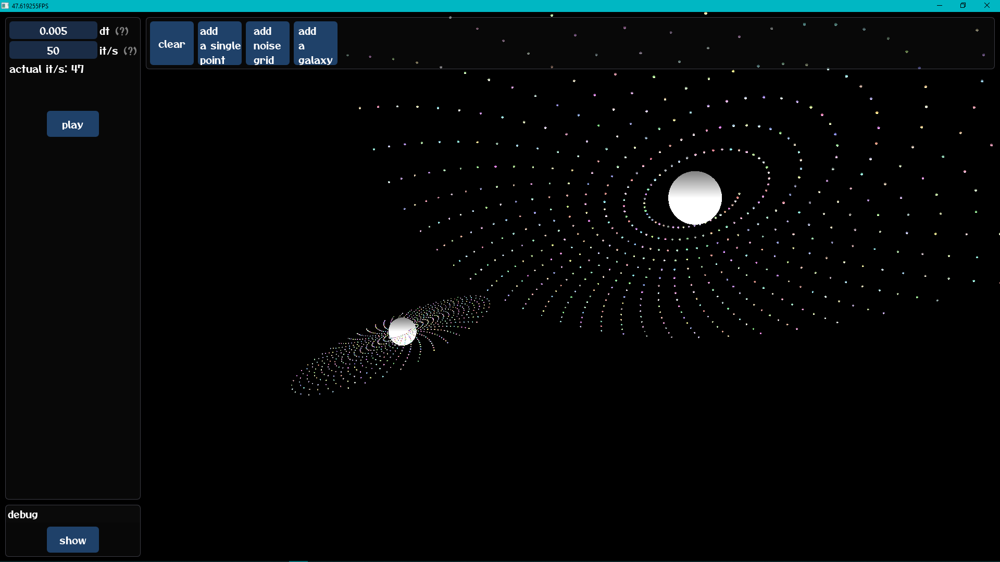
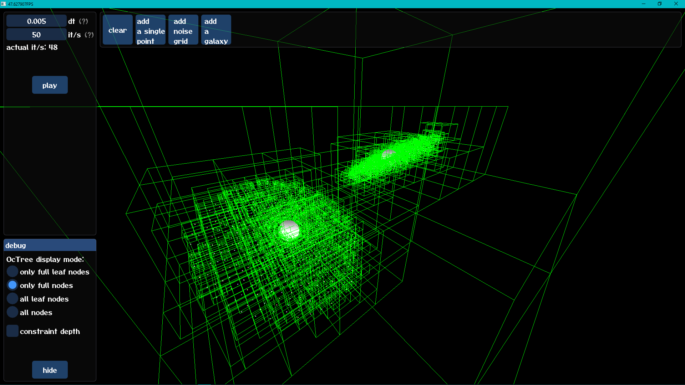
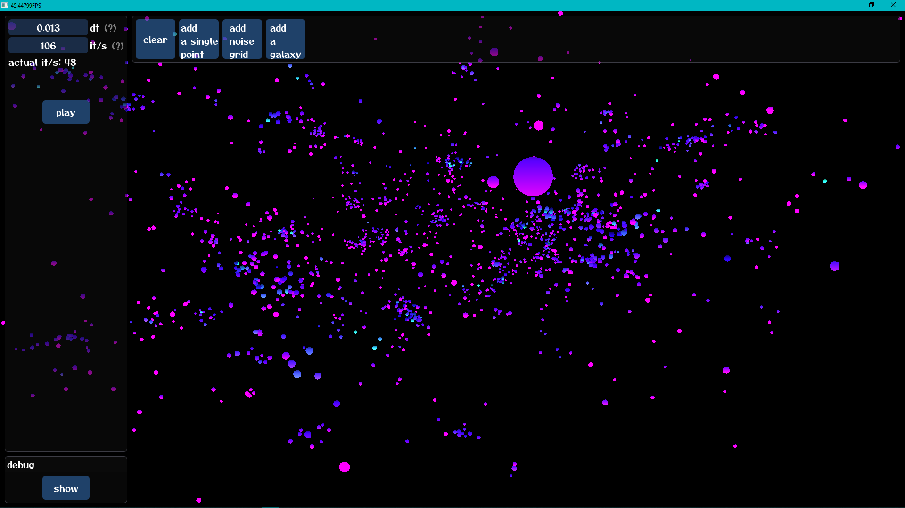
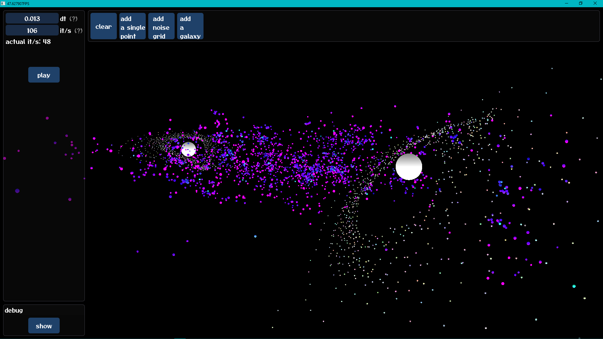

# Barnes–Hut simulator
 Java implementation of [Barnes-Hut Simulation](https://en.wikipedia.org/wiki/Barnes–Hut_simulation).

 In short, it uses an [OcTree](https://en.wikipedia.org/wiki/Octree) to store all the masses in simulation and estimate the forces.

  

	
	
	
	
  

  
 ## Features
* blender-like orbit controls
* toolbar
* time and iteration count controls
* debug view

## Technologies
* Java
* lwjgl
* ImGUI
* GLSL
* Multithreading
